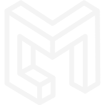

.. ml documentation master file, created by
   sphinx-quickstart on Thu Mar 15 13:55:56 2018.
   You can adapt this file completely to your liking, but it should at least
   contain the root `toctree` directive.

molecuLearn (ML)
================

.. container:: .large

   The objective of molecuLearn is to extract key patterns and molecular insights
   from ab-initio molecular dynamics (AIMD) trajectories.
   molecuLearn is a Python package.

.. container:: .buttons

   `Docs <getting_started.html>`_
   `GitHub <https://github.com/davidkastner/molecuLearn>`_

.. toctree::
   :maxdepth: 0
   :caption: Contents
   :hidden:

   getting_started
   api
